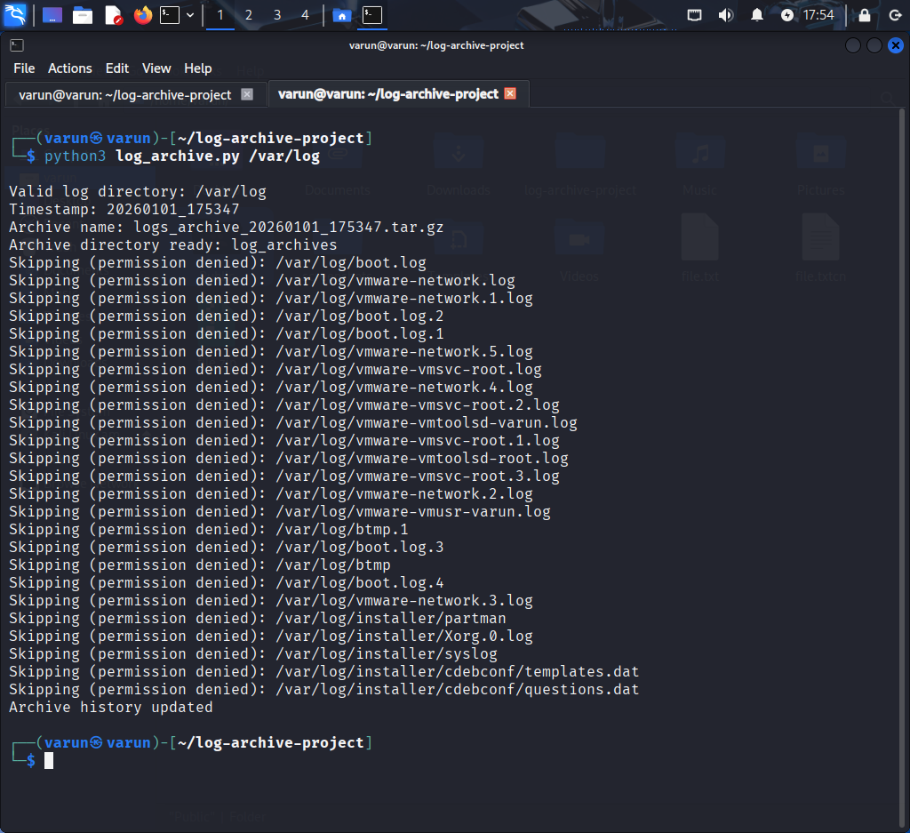
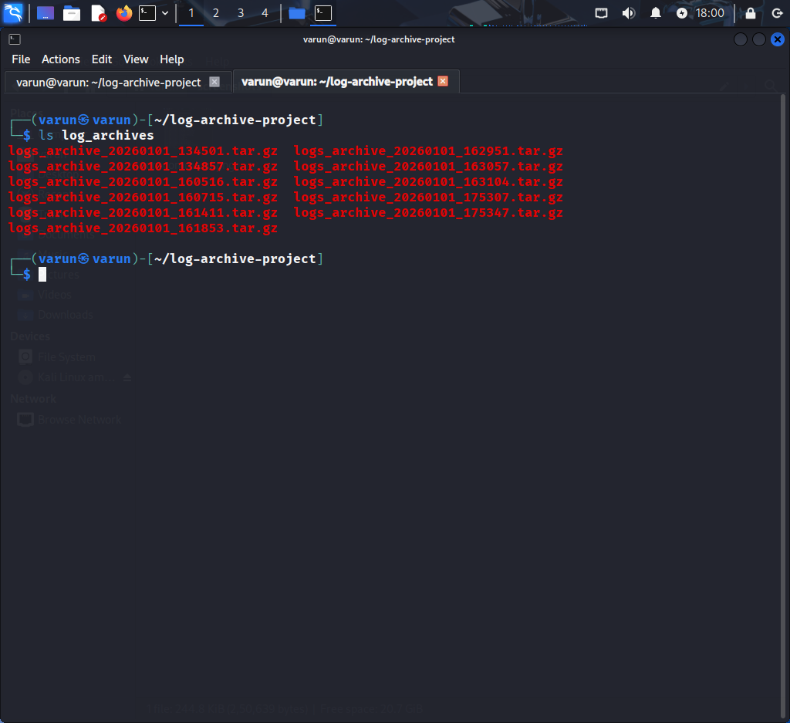
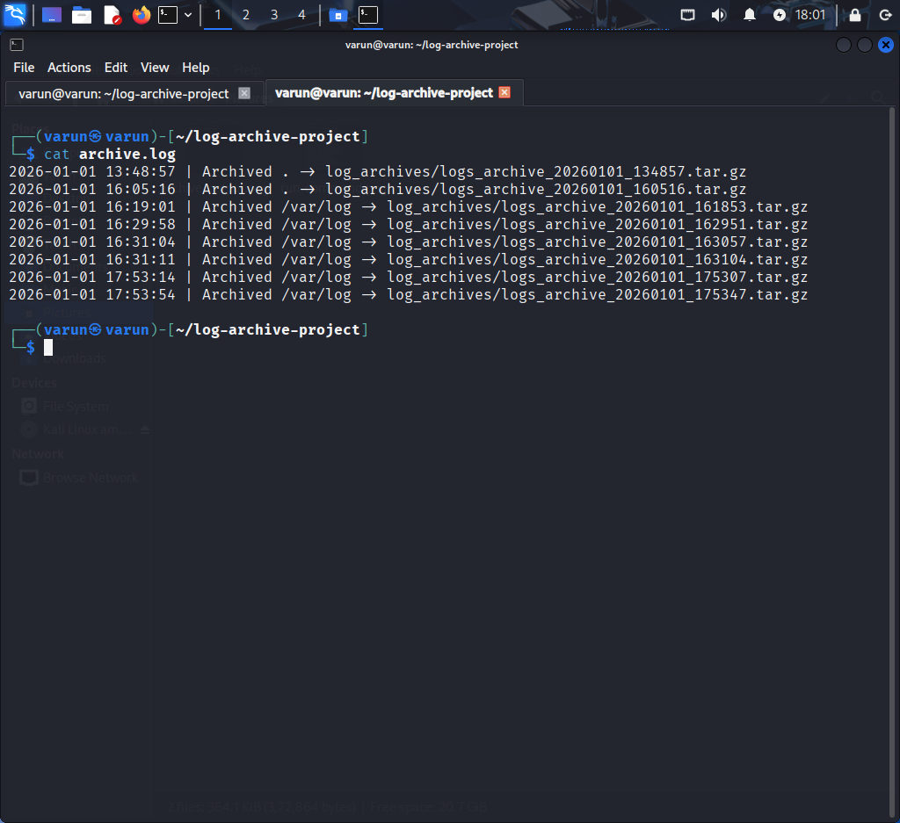

# Log Archive CLI Tool

A Python-based command-line tool to archive system logs by compressing them into timestamped `.tar.gz` files.  
Designed for Linux systems to automate log maintenance and cleanup.

## Skills Demonstrated

- Linux command-line usage
- Python scripting
- File & directory handling
- Log management
- Automation concepts
- Git & GitHub workflows

## Screenshots

### Running the CLI Tool

### Generated Archive

### Archive History Log

https://roadmap.sh/projects/log-archive-tool
